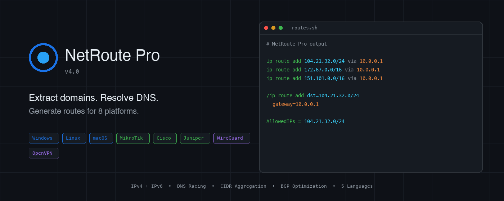
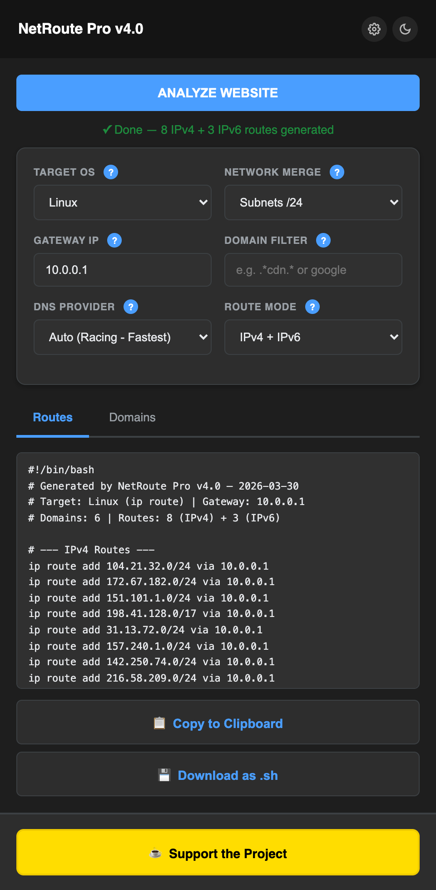
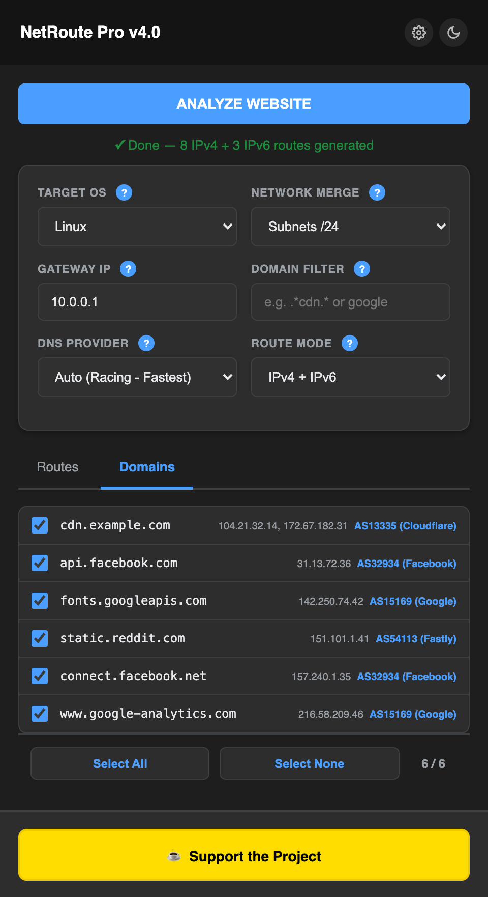
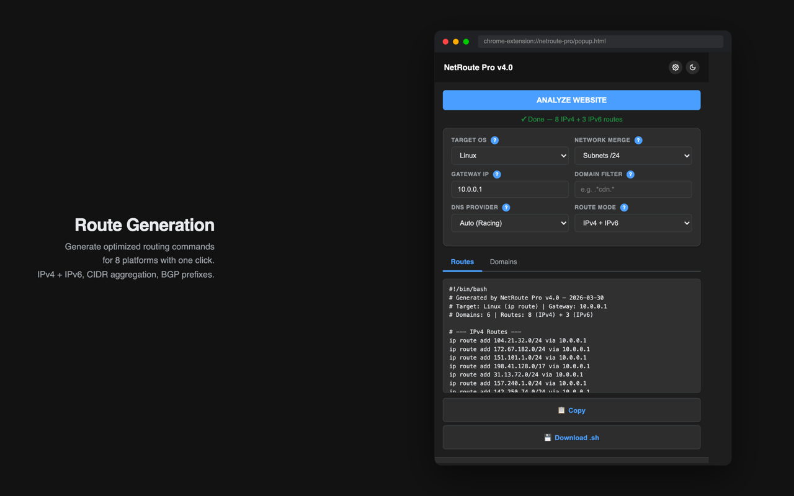

# NetRoute Pro

**Smart Route Generation for Network Engineers**

Chrome extension that discovers domains on any webpage, resolves IPs via racing DNS queries, and generates optimized routing commands for 8 platforms.

## Features

- **Network Sniffer** — captures dynamic background requests (AJAX, CDN, API) in real-time via Service Worker
- **DNS Racing** — queries Cloudflare, Google, Quad9 simultaneously via `Promise.any` — first response wins
- **CIDR Aggregation** — merges individual IPs into optimized subnets (IPv4 bitmask + IPv6 BigInt)
- **RIPE BGP Optimization** — fetches real BGP prefixes from RIPE Stat API to replace /32s with announced routes
- **ASN Lookup** — batch IP-to-ASN resolution (e.g. `AS13335 (Cloudflare)`)
- **Bulk Scan** — paste a list of URLs, generate aggregated routes for all hostnames at once
- **Domain Blacklist** — exclude analytics/trackers, syncs across devices via Chrome Cloud Sync
- **Pro Export** — download as `.bat`, `.sh`, or `.rsc` with proper headers and verification commands

## Supported Platforms

| Platform | IPv4 | IPv6 |
|----------|------|------|
| **Windows** | `route add {net} mask {mask} {gw}` | `netsh interface ipv6 add route` |
| **Linux** | `ip route add {net}/{cidr} via {gw}` | `ip -6 route add` |
| **macOS** | `route add -net {net}/{cidr} {gw}` | `route add -inet6` |
| **MikroTik** | `/ip route add dst-address=` | `/ipv6 route add` |
| **Cisco** | `ip route {net} {mask} {gw}` | `ipv6 route` |
| **Juniper** | `set routing-options static route` | `set rib inet6.0 static route` |
| **WireGuard** | `AllowedIPs = {net}/{cidr}` | `AllowedIPs = {addr}` |
| **OpenVPN** | `route {net} {mask}` | `route-ipv6` |

## Screenshots

### Routes Generation

### Domain Discovery

### Extension in Browser

## How It Works

1. **Install & Navigate** — add the extension from Chrome Web Store, navigate to any site
2. **Configure & Scan** — choose target OS, merge mask, gateway, domain filter, click Analyze Website
3. **Copy or Export** — grab generated routes, copy to clipboard or export as script file

## Tech Stack

- Chrome Extension (Manifest V3)
- Service Worker for network sniffing
- DoH (DNS over HTTPS) with racing resolution
- RIPE Stat API for BGP prefix lookups
- 5 interface languages

## Support the Project

## License

MIT
